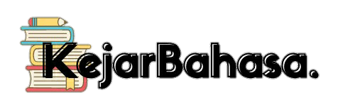

## About Kejar Bahasa

Kejar Bahasa ​​is a place where you can learn anything online. There are lots of learning modules available here that you can learn.

## Kejar Bahasa Team

1. **[Agung Prasetio](https://github.com/agungprasetio18)**
2. **[Arya Dhievha Rusdiana](https://github.com/Dhievha03)**
3. **[Muhammad Ramdhani](https://github.com/dhanifu)**
4. **[Yarra Raja Seraf](https://github.com/yarrars)**

## Screenshot

## License

The Kejar Bahasa website is licensed under the [MIT license](https://opensource.org/licenses/MIT).
